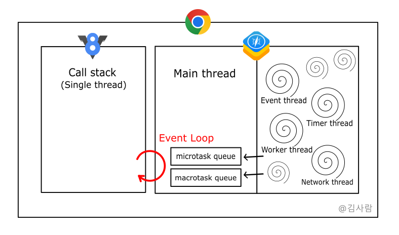

자바스크립트를 더욱 이해하려고 보니, 단순 암기로만 알고 있던 정보들에 아래와 같은 의문들이 생겼습니다.

 

- 자바스크립트는 언어인데, 왜 Single thread라고 하는 걸까?

- Web API, Promise와 같은 비동기 작업은 어느 thread에서 처리할까?

- Event Loop가 Main thread에서 발생한다는데, Main thread는 어디에 있을까?

- Node.js 환경에서는 Web API를 어떻게 처리할까?

 

이런 의문들을 풀기 위해 수집한 정보들을 정리하였습니다.

혹 틀린 부분이 있다면 댓글 부탁드립니다.

---

> Single thread?

자바스크립트는 경량화를 위해 Single thread 환경에서 실행되도록 만들어진 언어입니다.

즉 자바스크립트 엔진의 실행 파트가 Single thread로 동작하는 것이고, 따라서 Call stack이 하나라는 의미가 되기도 합니다.

> Call stack?

함수의 호출 상황을 기록하고 제어하는 메커니즘입니다.

함수가 호출되면 해당 함수의 실행 컨텍스트가 Call stack에 추가된 후 함수가 처리됩니다. 따라서 Execution Context Stack이라고도 합니다.

콜 스택은 자바스크립트 엔진에 포함되어 있습니다.

> 자바스크립트 엔진?

자바스크립트 엔진은 자바스크립트를 해석하고 실행하는 등의 역할을 합니다.

대표적으로 V8이 있으며, 자바스크립트 런타임(브라우저, Node.js)에 내장되어 있습니다.

자바스크립트 엔진의 실행 파트가 단일 스레드로 동작하기 때문에, Event Loop도 하나만 있으면 됩니다.

따라서 Event Loop가 발생하는 브라우저의 Main thread도 단일 스레드입니다.

> Main thread?

모든 브라우저는 자바스크립트 엔진과 브라우저 엔진(렌더링 엔진)이 존재합니다.

크롬의 경우 Webkit을 포크한 Blink라는 브라우저 엔진을 사용하고 있습니다.

Node.js는 비슷한 역할을 하는 libuv라는 라이브러리가 있습니다.

 

Main thread는 브라우저 엔진의 렌더러 프로세스에 존재하며, 브라우저로 전송된 대부분의 코드를 처리합니다.

HTML과 CSS를 파싱하고, 레이아웃 트리를 만드는 등 렌더링 작업의 대부분을 처리하고 지휘합니다.

여기서 다룰 점은 Main thread는 브라우저 엔진의 스레드이고, **Event Loop를 담당**한다는 점입니다.

> Event Loop?

Event Loop는 비동기적인 코드의 실행을 관리하며, 이벤트 발생과 처리를 조율합니다.

콜 스택이 비었을 때, **Task queue에 쌓인 태스크를 Call stack으로 넘겨 실행**하는 역할을 합니다.

Task queue가 비었을 때는 동작하지 않고, 태스크가 있을 때 동작합니다.

콜 스택이 비었음을 확인하고, 태스크를 처리하는 과정을 반복하기에 Loop라고 합니다.

> Task queue?

Task queue는 이벤트 큐 혹은 콜백 큐라고도 불리며, 보통 Macrotask queue를 가리킵니다.

하지만 V8에는 Macrotask queue 외에 Microtask queue도 존재합니다.

 

- Microtask queue에는 Promise, async/await, queueMicrotask로 처리한 태스크가 쌓입니다.

- Macrotask queue에는 이벤트 핸들러, setTimeout, setInterval, etc에서 처리한 태스크가 쌓입니다.

 

Event Loop 과정에서 Microtask를 우선 처리합니다.

따라서 Microtask queue의 태스크들을 모두 처리한 이후에 Macrotask를 처리합니다.

---

#### Event Loop Map

Thread를 중심으로 Event Loop Map을 도식화하였습니다.

크롬을 기준으로 하였고, Blink 로고가 존재하지 않아 Webkit 로고로 대체하였습니다.

간소화한 것이라 생략된 개념이 존재합니다.

1. 비동기 함수가 호출되면 실행 컨텍스트가 콜 스택에 쌓이지 않고, 브라우저 엔진의 해당 스레드에 생성됩니다.

2. 해당 스레드에서 비동기 함수를 처리 후, 그 결과(태스크)가 태스크 큐에 쌓입니다.

3. 처리할 태스크가 있으니 메인 스레드에서 이벤트 루프를 통해 콜 스택이 비었는지 확인합니다.

4-1. 콜 스택이 비었다면, 이벤트 루프를 통해 큐에 쌓인 태스크를 콜 스택으로 넘깁니다.

4-2. 콜 스택이 차 있다면, 콜 스택이 빌 때까지 기다립니다.

 

브라우저는 다양한 프로세스로 구성되어 있고, 프로세스는 다양한 스레드로 구성되어 있습니다.

앞서 말한 것처럼 메인 스레드는 렌더러 프로세스에 속하듯, 각 스레드는 속하는 프로세스가 존재합니다.

다른 프로세스에 속하는 스레드 간 통신은 IPC(Inter Process Communication)를 이용합니다.

  

#### 정리

- 자바스크립트는 Single thread 언어이지만, 런타임의 여러 스레드를 이용하기에 Multi thread로 동작한다.

- 자바스크립트 엔진이 동작하는 동안 브라우저 엔진이 다른 태스크를 처리하기에 비동기적 처리가 가능하다.

  - Node.js의 경우 libuv 라이브러리의 Thread pool에서 처리한다.

- 브라우저 엔진이 처리한 태스크는 큐에 쌓이며, 이는 이벤트 루프를 통해 콜 스택으로 넘어가 실행된다.

---

### 참고 링크

- [어쨌든 이벤트 루프는 무엇입니까? | Philip Roberts | JSConf EU](https://www.youtube.com/watch?v=8aGhZQkoFbQ&ab_channel=JSConf)

- [최신 브라우저의 내부 살펴보기 3 - 렌더러 프로세스의 내부 동작](hhttps://d2.naver.com/helloworld/5237120)

- [이벤트 루프와 매크로태스크, 마이크로태스크](https://ko.javascript.info/event-loop)

- [[JavaScript] 이벤트 루프(Event loop) 정리](https://youngju-js.tistory.com/28)

- [자바스크립트는 왜 싱글 스레드를 선택했을까? 프로세스, 스레드, 비동기, 동기, 자바스크립트 엔진, 이벤트루프](https://miracleground.tistory.com/entry/%EC%9E%90%EB%B0%94%EC%8A%A4%ED%81%AC%EB%A6%BD%ED%8A%B8%EB%8A%94-%EC%99%9C-%EC%8B%B1%EA%B8%80-%EC%8A%A4%EB%A0%88%EB%93%9C%EB%A5%BC-%EC%84%A0%ED%83%9D%ED%96%88%EC%9D%84%EA%B9%8C-%ED%94%84%EB%A1%9C%EC%84%B8%EC%8A%A4-%EC%8A%A4%EB%A0%88%EB%93%9C-%EB%B9%84%EB%8F%99%EA%B8%B0-%EB%8F%99%EA%B8%B0-%EC%9E%90%EB%B0%94%EC%8A%A4%ED%81%AC%EB%A6%BD%ED%8A%B8-%EC%97%94%EC%A7%84-%EC%9D%B4%EB%B2%A4%ED%8A%B8%EB%A3%A8%ED%94%84)

- [[Browser] 브라우저 렌더링](https://beomy.github.io/tech/browser/browser-rendering/)

- [Node.js 이벤트 루프(Event Loop) 샅샅이 분석하기](https://www.korecmblog.com/node-js-event-loop/)

- [ChatGPT](https://chat.openai.com/chat)
