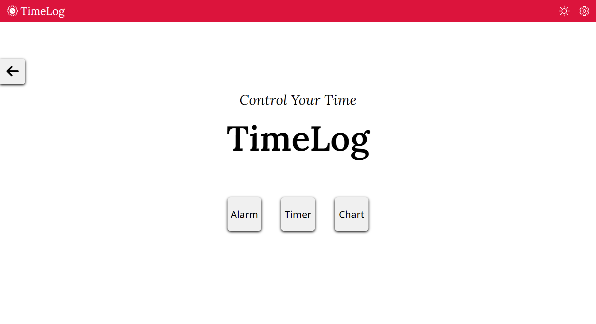
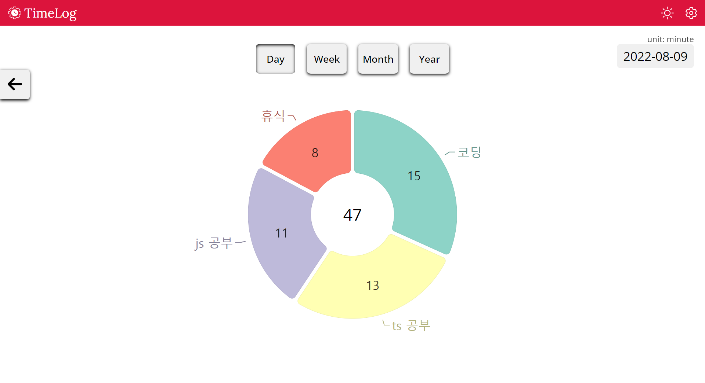
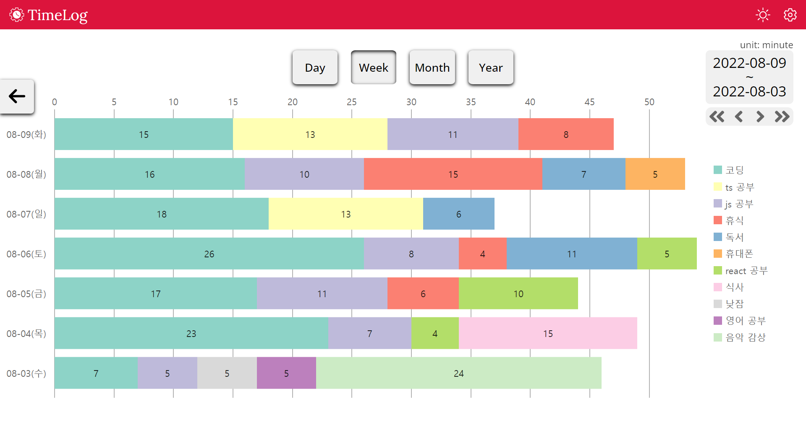
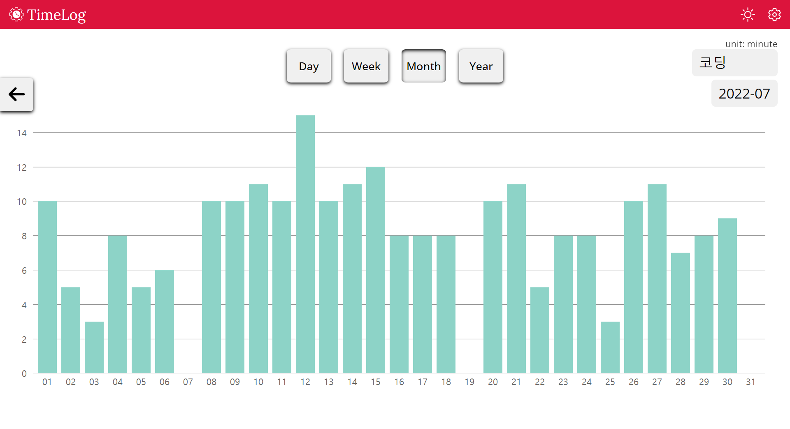
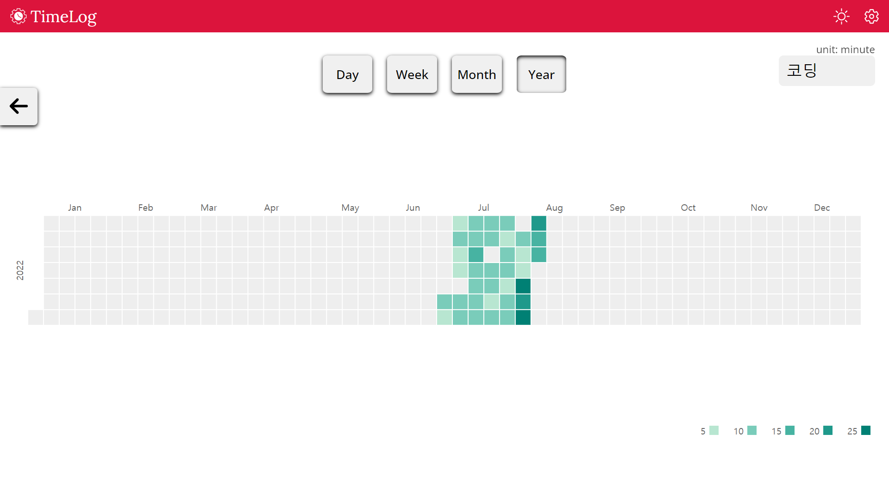

> ##### Control your time.

모두에게 공평하게 주어지는 자산이 있습니다.  

바로 **시간**입니다.  

이 자산을 어떻게 사용하느냐에 따라 삶이 결정됩니다.

자신의 시간을 계획적으로 사용하는 사람과, 시간에 끌려다니는 사람의 차이는 시간이 갈수록 극명해집니다.  

당신의 시간을 적극 활용하십시오.

  

> ##### Your focus determins your reality.

그렇다면 이 시간을 어디에 할애할지 두 가지 질문을 통해 알아봅시다.  

- 당신이 바라는 삶은 무엇입니까?  
- 그 삶을 이루기 위해 해야 하는 것은 무엇입니까?  

그럼 그것에 집중하십시오.  

---

# [TimeLog](https://saramkim.github.io/time-log)

시간 기록 웹사이트를 만들었습니다.

얼마의 시간 동안 무엇을 했는지 기록하고. 시간 차트를 통해 그 기록들을 확인할 수 있습니다.

  

\*예시 사진입니다.
  

###### v0.8

- PC 브라우저에서만 타이머 정상 작동 (모바일 백그라운드에서 타이머 지연)
- 로컬스토리지를 이용하여, ‘쿠키 및 기타 사이트 데이터’ 삭제 시 데이터 소멸
- 추후 로그인 기능을 도입하여 아이디 간 데이터 연동, 모바일 정상 지원 예정

---

- ### Manual

> ##### Alarm

- 마감 시간을 만들어 집중력 향상 (Deadline Effect)

- 집중력이 부족할 때 짧은 주기로 알람 (딴짓 예방)

- 휴식할 시간을 정하고 휴식

- 뽀모도로 기법 활용  

> ##### Timer

- 집중하는 시간 기록

- 최대 집중 시간 갱신 성취감  

> ##### Chart

- 절대 집중 시간 확인

- 메타인지, 자기 객관화

- 성찰, 피드백

- 수치로 볼 수 있는 발전  

> ##### 추천 사용법

**0. TimeLog 탭 우클릭 → 탭 고정**  

**1. 집중을 시작할 때 Alarm 재생** (알람 시간: 10~15분)  

**2. 알람이 울릴 때마다 방금 하고 있던 일 기록**

- _알람 시간 동안 한 일들 X_
- _알람이 울렸을 때 방금 하고 있던 일 O_  

**3. 딴짓하지 않고 집중하는 일만 기록하게 되면 알람 시간 연장**

_ex) 연속 5번 집중에 성공할 때마다 알람 시간 10분씩 연장_
  

**4. 알람 설정 시간이 1시간이 되면 Timer 이용**  

**5. 집중하는 시간을 타이머로 모두 기록**  

**6. 차트로 그려진 시간 기록을 보며 자기 객관화**  

**7. 목표 및 계획 설정, 그리고 이행**

  

> 선생도, 감독도 없으니 자신에게만 솔직하면 됩니다.

> 비교 대상은 오로지 과거의 자신입니다.
