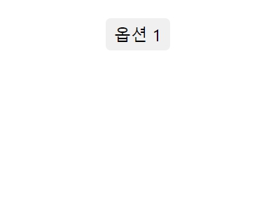
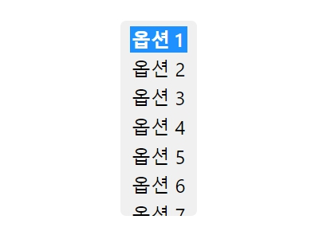

### select 태그 이용

- select 태그를 사용하지 않고, div 태그를 이용하여 커스텀 셀렉트 박스를 만들 수 있습니다.<br></br>

- 하지만 저는 select 태그를 이용하여 아래와 같은 셀렉트 박스를 만들었습니다.

---

|  |  |
| ---------------------------------------------- | ------------------------------------------ |

---

- 박스를 클릭했을 때 보이는 옵션의 개수를 제한하기 위해 select 태그의 동작을 이벤트마다 직접 코딩하였습니다.<br></br>

- 스크롤바가 없기 때문에 스크롤 다운이 가능하다는 것을 표시하기 위해 밑의 옵션을 절반만 보이게 디자인하였습니다.<br></br>

- 선택된 옵션이 파란 배경이 되는 것은 변경할 방법이 없는 것 같습니다. (select 태그의 한계..)<br></br>

> React

```js
// jsx in react
<select
  onFocus={(e) => {
    if (e.target.childElementCount > 7) {
      e.target.size = 7;
    } else {
      e.target.size = e.target.childElementCount;
    }
  }}
  onBlur={(e) => {
    e.target.size = 1;
  }}
  onChange={(e) => {
    e.target.blur();
  }}
  ...
>
  <option>...</option>
  ...
</select>
```

> CSS

```css
/* css */
select::-ms-expand {
  display: none;
}
select {
  -o-appearance: none;
  -webkit-appearance: none;
  -moz-appearance: none;
  appearance: none;

  position: absolute; /* 상대위치 X / 절대위치 O */
  padding: 0.3em 0.5em;
  border-radius: 0.3em;
  background-color: #f0f0f0;
  border: none;
  font-family: inherit; /* 이미 font-family가 있거나 reset css 적용시 필요 X */
  font-size: 1.5rem;
  cursor: pointer;
}
select:focus {
  outline: none;
  font-weight: 600;
}
select:hover {
  font-weight: 600;
}
select::-webkit-scrollbar {
  display: none;
}
select option {
  margin-bottom: 0.15em;
}
select option:checked,
select option:hover {
  font-weight: 600;
}
```
